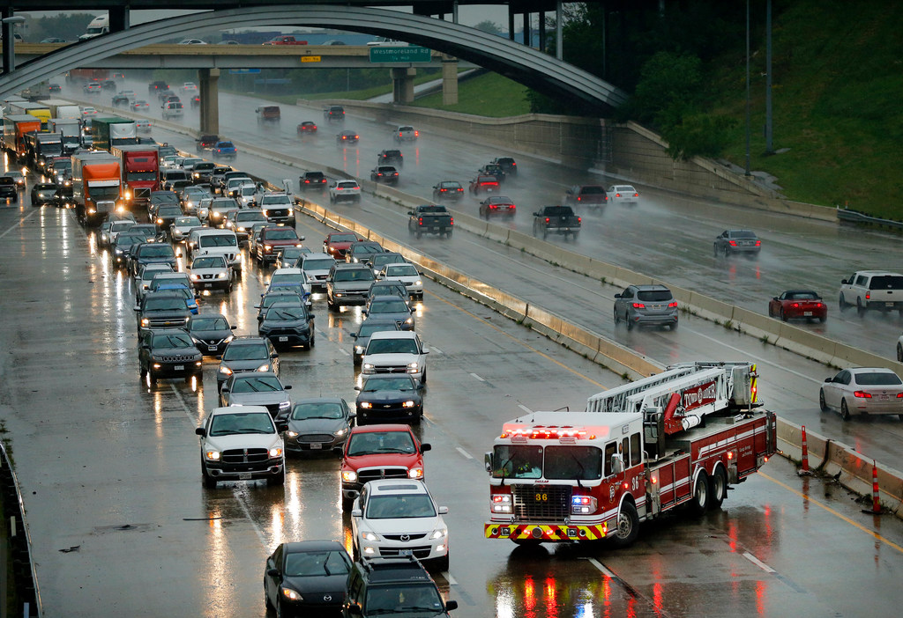
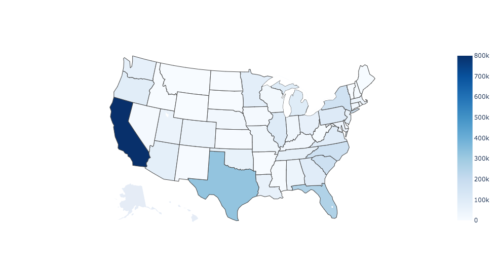
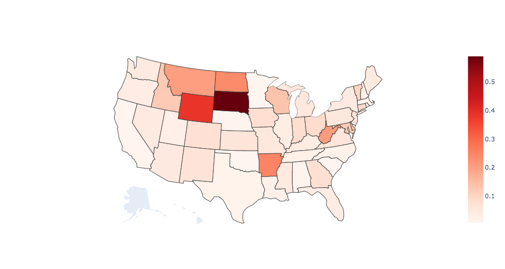
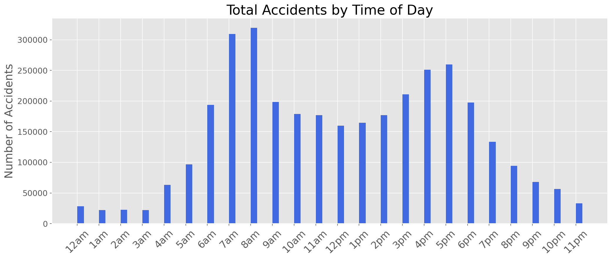
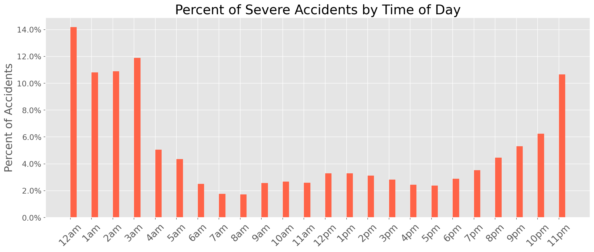

# US Traffic Accidents and their Influencing Factors
## Background & Goal:
It's no secret that the United States loves to drive. With over than 260 million vehicles in operation, car transportation has been engrained in the American pysche. This love affair hasn't come without flaws though. In the United States, the average number of car accidents each year is around 6 million, resulting in more than 38,000 deaths on US roadways. While automobiles may be an essential part of many Americans lives, its important to explore some of the data behind these accidents and assess how it can be used to save lives in the future. [US Accident Dataset](https://www.kaggle.com/sobhanmoosavi/us-accidents) provides detailed statistics about personal injury road accidents, vehicles and locations involved. These statistics were compiled by various entities around the country, such as law enforcement agencies, traffic cameras, and numerous state Departments of Transportation.

The goal of this repository is to help emergency services identify the key elements of severe accidents, and understand trends of where and when they are most needed. 

## Cleaning & Data Review:

This data is made up of recorded traffic accidents around the contiguous United States from February 2016 to June 2020. There are over 3.5 million records and 49 unique initial features.

|ID |Source  |TMC|Severity|Start_Time |End_Time    |Start_Lat|Start_Lng |End_Lat|End_Lng|Distance(mi)|Description                                                                          |Number|Street                   |Side|City        |County    |State|Zipcode   |Country|Timezone  |Airport_Code|Weather_Timestamp|Temperature(F)|Wind_Chill(F)|Humidity(%)|Pressure(in)|Visibility(mi)|Wind_Direction|Wind_Speed(mph)|Precipitation(in)|Weather_Condition|Amenity|Bump |Crossing|Give_Way|Junction|No_Exit|Railway|Roundabout|Station|Stop |Traffic_Calming|Traffic_Signal|Turning_Loop|Sunrise_Sunset|Civil_Twilight|Nautical_Twilight|Astronomical_Twilight|
|---|--------|---|--------|-----------|------------|---------|----------|-------|-------|------------|-------------------------------------------------------------------------------------|------|-------------------------|----|------------|----------|-----|----------|-------|----------|------------|-----------------|--------------|-------------|-----------|------------|--------------|--------------|---------------|-----------------|-----------------|-------|-----|--------|--------|--------|-------|-------|----------|-------|-----|---------------|--------------|------------|--------------|--------------|-----------------|---------------------|
|A-1|MapQuest|201|3       |2/8/16 5:46|2/8/16 11:00|39.865147|-84.058723|       |       |0.01        |Right lane blocked due to accident on I-70 Eastbound                                 |      |I-70 E                   |R   |Dayton      |Montgomery|OH   |45424     |US     |US/Eastern|KFFO        |2/8/16 5:58      |36.9          |             |91         |29.68       |10            |Calm          |               |0.02             |Light Rain       |FALSE  |FALSE|FALSE   |FALSE   |FALSE   |FALSE  |FALSE  |FALSE     |FALSE  |FALSE|FALSE          |FALSE         |FALSE       |Night         |Night         |Night            |Night                |
|A-2|MapQuest|201|2       |2/8/16 6:07|2/8/16 6:37 |39.928059|-82.831184|       |       |0.01        |Accident on Brice Rd at Tussing Rd. Expect delays.                                   |2584  |Brice Rd                 |L   |Reynoldsburg|Franklin  |OH   |43068-3402|US     |US/Eastern|KCMH        |2/8/16 5:51      |37.9          |             |100        |29.65       |10            |Calm          |               |0                |Light Rain       |FALSE  |FALSE|FALSE   |FALSE   |FALSE   |FALSE  |FALSE  |FALSE     |FALSE  |FALSE|FALSE          |FALSE         |FALSE       |Night         |Night         |Night            |Day                  |

The table above displays the raw data, broken down into Numerical, Categorical, Boolean, and Binary Data. In the dataset, there are a variety of erroneous and missing values. 

* Substantial amount of missing information. Several features were misssing over 50% of their data: "TMC (Traffic Message Channel)", "End_Lat", "End_Lng", "Number(Street Address)", "Wind_Chill(F)", "Wind_Speed(mph)", and "Precipitation(in)". Certain features were adjusted depending on their impact toward accident severity. 
    * Null values from numerical features including 'Temperature(F)', 'Humidity(%)', 'Pressure(in)', 'Visibility(mi)', 'Wind_Speed(mph)', 'Distance(mi)' were replaced with the mean value.
    * Regarding "Pressure(in)" and "Visibility(mi)" features, it can be inferred that the missing values were replaced with 0. A value of 0 for either feature is not liekly feasible, so those records were dropped. 
    * Duplicate records were dropped

* Features that would result from the accident already taking place, were redundant, or did not carry any information regarding the severity were dropped.
    * These included "Source", "TMC", "End_Lat", "End_Lng", "Number", "Street", "Airport_Code", "Weather_Timestamp", "Wind_Chill(F)", "Turning_Loop", "Sunrise_Sunset", "Nautical_Twilight", and "Astronomical_Twilight".

* The "Weather_Condition" feature contained over 128 unique entries such as 'Overcast', 'Mostly Cloudy', 'Partly Cloudy / Windy', 'Light Snow', 'Haze', Scattered Clouds' 'Partly Cloudy', etc. The majority of entries were repetive and synonymous, which were reduced and grouped into 6 general descriptions: 'Cloudy', 'Clear', 'Rain', 'Snow', 'Fog', and 'Thunderstorm'. 

* Converted boolean features into integers

## Exploratory Data Analysis:

After the dataset was cleaned, I performed some Exploratory Data Analysis (EDA) on the features to confirm my initial assumptions and see if any other features had strong relationships toward accident severity. In the dataset, severity is broken down into four separate categories: slight (1), moderate (2), significant(3), and fatal (4). For this analysis, I wanted to create a binary target variable to see the distinction of whether an accident was severe by whether it was fatal or not. Slight, moderate, and significant accidentss were grouped into a non-severe class (0) and fatal accidents were severe (1). 

### Geographic Distribution:

#### 
Total Severe Accidents in each State

Above is the distribution of severe accidents by state. As expected, states with larger populations have higher amounts of severe accidents occuring. 
#### 
Proportion of Severe Accidents by Total Accidents in each State

In comparison, the proportion of severe accidents over the total amount of accident varies greatly. From the early analysis, I found that it was difficult to generalize features that have a strong relationship across the entire country. For example, an accident in Florida can look vastly different than an accident in Wyoming. Florida is highly urbanized and is in a sub-tropical climate, whereas Wyoming is much more rural with greater temperature extremes in the summer and winter. With this knowledge, I grouped the states in their respective regions in order to make more precise insights on the features involving severity. The table below shows the regional groupings and proportions of severe accidents. 

    

|**Region**|**Proportion of Severe Accidents**|
|------|------------------------------|
|Rockies|5.30%                         |
|Midwest|4.90%                         |
|Northeast|4.70%                         |
|Southeast|3.60%                         |
|Southwest|1.90%                         |
|Pacific|1.40%                         |

  

### Feature Engineering:

The table below shows my cleaned and feature engineered dataframe.

It is important to note that for this examination, I am not conducting any predictive models. Instead I am looking at this through the lense of an inferential analysis: determing the features that have the strongest relationship toward accident severity. I wanted to infer properties from the data, not make predictions on unseen data.  

Performed Feature Engineering with regards to Inferential Regression

Inferential Regression Assumptions:
1. Independence
2. Normality 
3. No multicollinearity: the independent variables are not highly correlated with each other 

Applied Feature Engineering to the Time column, where the hour was extracted and used to create a binary Rush Hour feature, which in the UK is generally considered to be between 07:00-10:00 and 16:00-19:00
* Appears to show lower proportion during typical busy hours

Used Day of Week to create a binary Weekend feature
* Higher proportion during Saturday and Sunday

 Urban             |  Rural
:-------------------------:|:-------------------------:
  |  

More accidents in Urban areas, but there is higher proportion of severe accidents in rural areas.
Speed Limit shares a similar trend, that as the limit increase, so does the proportion of Severe Accidents.

## Inferential Logistic Regression

Determined Multicolinearity with Variance Inflation Factor (VIF). As the name suggests, a variance inflation factor (VIF) quantifies how much the variance is inflated. A variance inflation factor exists for each of the predictors in a multiple regression model. A VIF of 1 means that there is no correlation, while VIFs exceeding 10 are signs of serious multicollinearity requiring correction. In the data, BLANK features were dropped due to their high values, both exceeding 20. 

Due to the abudance of categorical features, there are several columns that need to be one-hot encoded or changed to a binary value in order to utilize there features. By dropping one of the one-hot encoded columns from each categorical feature, we ensure there are no "reference" columns — the remaining columns become linearly independent. These features included: 

* Road Surface: Dry, Wet or damp, Snow, Frost or ice, Flood over 3cm. deep, Oil or diesel
* Road Type: Roundabout, One way street, Dual carriageway, Single carriageway, Slip road
* Weather: Fine no high winds, Raining no high winds, Snowing no high winds, Fine + high winds, Fog or mist
* Light Conditions: Daylight, Darkness - lights lit, Darkness - lights unlit
* Pedestrian Crossing Physical: Zebra, Footbridge or subway, Pedestrian phase at traffic signal junction

Additional Steps:
* Balanced data so Severe and Minor were equal
* Standarized the data in order to be able to compare coefficients
    * Only standarized Speed Limit

### Logit Model for Feature Importance

| Features                                        | Coeff - Log Odds | Coeff - Odds |
|-------------------------------------------------|------------------|----------------------|
| Road Type - Dual Carriageway                    | -0.376           | 0.686                |
| Road Surface Conditions - Frost/Ice             | -0.385           | 0.68                 |
| Light Conditions - Dark with No street lighting | 0.421            | 1.523                |
| Road Type - Roundabout                          | -0.584           | 0.557                |
| Road Type - Slip Road                           | -0.769           | 0.463                |

Pseudo R-squared: 0.020

* Above, the positive scores indicate a feature that influences class 1 "Severe", whereas the negative scores indicate a feature that influences class 0 "Minor"
* The further from zero, the more impact it has in determining severe or minor
* With the features that are one-hot encoded, you’re comparing to the feature dropped. 

## Conclusion & Future Direction

* Continue training this model to improve its performance and maximize its potential - an R-squared of 0.02 is not enough
    * Regularize, manipulating features

* Compare feature importance with other models such as random forest and XGBoost

* Look into other features as potential target variables such as Number of Casualties or Number of Vehicles to see if it improves the model. 

* Once model improves, perform a predictive regression to determine future accidents

