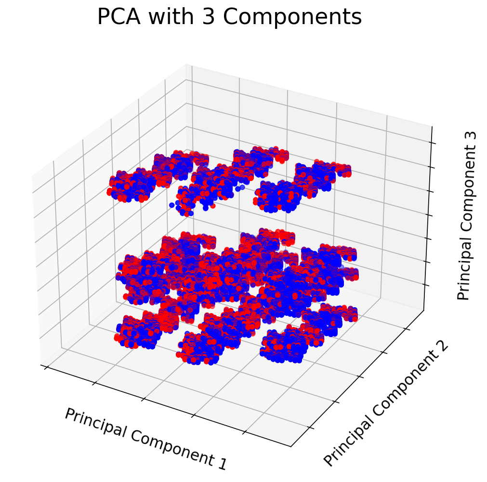

# US Traffic Accidents and their Influencing Factors
## Background & Goal:
It's no secret that the United States loves to drive. With over than 260 million vehicles in operation, car transportation has been engrained in the American pysche. This love affair hasn't come without flaws though. In the United States, the average number of car accidents each year is around 6 million, resulting in more than 38,000 deaths on US roadways. While automobiles may be an essential part of many Americans lives, its important to explore some of the data behind these accidents and assess how it can be used to save lives in the future. [US Accident Dataset](https://www.kaggle.com/sobhanmoosavi/us-accidents) provides detailed statistics about personal injury road accidents, vehicles and locations involved. These statistics were compiled by various entities around the country, such as law enforcement agencies, traffic cameras, and numerous state Departments of Transportation.

The goal of this repository is to help emergency services identify the key elements of severe accidents, and understand trends of where and when they are most needed. 

## Cleaning & Data Review:

This data is made up of recorded traffic accidents around the contiguous United States from February 2016 to June 2020. There are over 3.5 million records and 49 unique initial features.

|ID |Source  |TMC|Severity|Start_Time |End_Time    |Start_Lat|Start_Lng |End_Lat|End_Lng|Distance(mi)|Description                                                                          |Number|Street                   |Side|City        |County    |State|Zipcode   |Country|Timezone  |Airport_Code|Weather_Timestamp|Temperature(F)|Wind_Chill(F)|Humidity(%)|Pressure(in)|Visibility(mi)|Wind_Direction|Wind_Speed(mph)|Precipitation(in)|Weather_Condition|Amenity|Bump |Crossing|Give_Way|Junction|No_Exit|Railway|Roundabout|Station|Stop |Traffic_Calming|Traffic_Signal|Turning_Loop|Sunrise_Sunset|Civil_Twilight|Nautical_Twilight|Astronomical_Twilight|
|---|--------|---|--------|-----------|------------|---------|----------|-------|-------|------------|-------------------------------------------------------------------------------------|------|-------------------------|----|------------|----------|-----|----------|-------|----------|------------|-----------------|--------------|-------------|-----------|------------|--------------|--------------|---------------|-----------------|-----------------|-------|-----|--------|--------|--------|-------|-------|----------|-------|-----|---------------|--------------|------------|--------------|--------------|-----------------|---------------------|
|A-1|MapQuest|201|3       |2/8/16 5:46|2/8/16 11:00|39.865147|-84.058723|       |       |0.01        |Right lane blocked due to accident on I-70 Eastbound                                 |      |I-70 E                   |R   |Dayton      |Montgomery|OH   |45424     |US     |US/Eastern|KFFO        |2/8/16 5:58      |36.9          |             |91         |29.68       |10            |Calm          |               |0.02             |Light Rain       |FALSE  |FALSE|FALSE   |FALSE   |FALSE   |FALSE  |FALSE  |FALSE     |FALSE  |FALSE|FALSE          |FALSE         |FALSE       |Night         |Night         |Night            |Night                |
|A-2|MapQuest|201|2       |2/8/16 6:07|2/8/16 6:37 |39.928059|-82.831184|       |       |0.01        |Accident on Brice Rd at Tussing Rd. Expect delays.                                   |2584  |Brice Rd                 |L   |Reynoldsburg|Franklin  |OH   |43068-3402|US     |US/Eastern|KCMH        |2/8/16 5:51      |37.9          |             |100        |29.65       |10            |Calm          |               |0                |Light Rain       |FALSE  |FALSE|FALSE   |FALSE   |FALSE   |FALSE  |FALSE  |FALSE     |FALSE  |FALSE|FALSE          |FALSE         |FALSE       |Night         |Night         |Night            |Day                  |

The table above displays the raw data, broken down into Numerical, Categorical, Boolean, and Binary Data. In the dataset, there are a variety of erroneous and missing values. 

* Substantial amount of missing information. Several features were misssing over 50% of their data: "TMC (Traffic Message Channel)", "End_Lat", "End_Lng", "Number(Street Address)", "Wind_Chill(F)", "Wind_Speed(mph)", and "Precipitation(in)". Certain features were adjusted depending on their impact toward accident severity. 
    * Null values from numerical features including 'Temperature(F)', 'Humidity(%)', 'Pressure(in)', 'Visibility(mi)', 'Wind_Speed(mph)', 'Distance(mi)' were replaced with the mean value.
    * Regarding "Pressure(in)" and "Visibility(mi)" features, it can be inferred that the missing values were replaced with 0. A value of 0 for either feature is not liekly feasible, so those records were dropped. 
    * Duplicate records were dropped.

* Features that would result from the accident already taking place, were redundant, or did not carry any information regarding the severity were dropped.
    * These included "Source", "TMC", "End_Lat", "End_Lng", "Number", "Street", "Airport_Code", "Weather_Timestamp", "Wind_Chill(F)", "Turning_Loop", "Sunrise_Sunset", "Nautical_Twilight", and "Astronomical_Twilight".

* The "Weather_Condition" feature contained over 128 unique entries such as 'Overcast', 'Mostly Cloudy', 'Partly Cloudy / Windy', 'Light Snow', 'Haze', Scattered Clouds' 'Partly Cloudy', etc. The majority of entries were repetive and synonymous, which were reduced and grouped into 6 general descriptions: 'Cloudy', 'Clear', 'Rain', 'Snow', 'Fog', and 'Thunderstorm'. 

* Converted boolean features into integers.

## Exploratory Data Analysis:

After the dataset was cleaned, I performed some Exploratory Data Analysis (EDA) on the features to confirm my initial assumptions and see if any other features had strong relationships toward accident severity. In the dataset, severity is broken down into four separate categories: slight (1), moderate (2), significant(3), and fatal (4). For this analysis, I wanted to create a binary target variable to see the distinction of whether an accident was severe by whether it was fatal or not. Slight, moderate, and significant accidentss were grouped into a non-severe class (0) and fatal accidents were severe (1). 

### Geographic Distribution:

#### 
Total Severe Accidents in each State

Above is the distribution of severe accidents by state. As expected, states with larger populations have higher amounts of severe accidents occuring. 
#### 
Proportion of Severe Accidents by Total Accidents in each State

In comparison, the proportion of severe accidents over the total amount of accident varies greatly. From early analysis, I found that it was difficult to generalize features that have a strong relationship across the entire country. For example, an accident in Florida can look vastly different than an accident in Wyoming. Florida is highly urbanized and is in a sub-tropical climate, whereas Wyoming is much more rural with greater temperature extremes in the summer and winter. With this knowledge, I grouped the states in their respective regions in order to make more precise insights on the features involving severity. The table below shows the regional groupings and proportions of severe accidents. 

    

|**Region**|**Proportion of Severe Accidents**|
|------|------------------------------|
|Rockies|5.30%                         |
|Midwest|4.90%                         |
|Northeast|4.70%                         |
|Southeast|3.60%                         |
|Southwest|1.90%                         |
|Pacific|1.40%                         |

  

### Feature Engineering:
In order to better represent the underlying problem and improving model performance, feature engineering was used on a variety of features in the dataset. For the "Start_Time" timestamp feature, year, month, weekday, day, and hour were extracted, in order to feed them to the models. With the intention of added simplicity, three additional features were created:
* 'Rush Hour' - Created a binary feature of whether an accident occurs during typical rush hour times, which in the US is generally considered to be between 07:00-10:00am and 3:00-7:00pm
* 'Weekend' - Used day of the week info to create a binary feature of whether an accident occurs during the weekend (Saturday & Sunday) or weekday (Monday - Friday)
* 'Season' - Used month info to create new feature that groups accidents into their respective seasons: Spring, Summer, Fall, Winter

The table below shows my cleaned and feature engineered dataframe.

|ID |Severity|Start Time |End Time    |Start Lat|Start Lng |Side|City        |County    |State|Zipcode   |Timezone  |Temperature(F)|Humidity(%)|Pressure(in)|Visibility(mi)|Wind Direction|Wind Speed(mph)|Precipitation(in)|Weather Condition|Amenity|Bump|Crossing|Give_Way|Junction|No Exit|Railway|Roundabout|Station|Stop|Traffic Calming|Traffic Signal|During Day|Year|Month|Weekday|Day|Hour|Rush Hour|Weekend|Season|Region |
|---|--------|-----------|------------|---------|----------|----|------------|----------|-----|----------|----------|--------------|-----------|------------|--------------|--------------|---------------|-----------------|-----------------|-------|----|--------|--------|--------|-------|-------|----------|-------|----|---------------|--------------|----------|----|-----|-------|---|----|---------|-------|------|-------|
|A-1|3       |2/8/16 5:46|2/8/16 11:00|39.865147|-84.058723|R   |Dayton      |Montgomery|OH   |45424     |US/Eastern|36.9          |91         |29.68       |10            |Calm          |8.217113951    |0.02             |Rain             |0      |0   |0       |0       |0       |0      |0      |0         |0      |0   |0              |0             |0         |2016|2    |0      |8  |5   |0        |0      |Winter|Midwest|
|A-1130|3       |6/24/16 12:49|6/24/16 13:34|37.320629|-121.995506|R   |San Jose    |Santa Clara|CA   |95129     |US/Pacific|75.9          |40         |30.06       |10            |NW            |10.4           |0                |Clear            |0      |0   |0       |0       |0       |1      |0      |0         |0      |0   |0              |0             |1         |2016|6    |4      |24 |12  |0        |0      |Summer|Pacific|
|A-951078|3       |9/28/19 9:34|9/28/19 10:18|41.840019|-71.411263|R   |Providence  |Providence|RI   |2904      |US/Eastern|68            |81         |29.68       |10            |SW            |8              |0                |Clear            |0      |0   |0       |0       |1       |0      |0      |0         |0      |0   |0              |0             |1         |2019|9    |5      |28 |9   |1        |1      |Fall  |Northeast|

Total accidents are greatest during typical rush hour times, which can be expected as that is when the greatest number of cars are on road.

In comparison, there is an inverse relationship, with dips occuring during the rush hour times and peaks in the late night and early morning hours. Presumably, accidents could be less severe during rush hour times because cars are typically moving slower. 

### Model Considerations

Inferential Analysis:
* It is important to note that for this examination, I am not conducting any predictive models. Instead I am looking at this through the lens of an inferential analysis: determing the features that have the strongest relationship toward accident severity. I want to infer properties from the data, not make predictions on unseen data.  

Balanced Data:
* Out of the 3.5 million records, only 108,000 were classified under the fatal severity. As such, I undersampled from the majority non-severe class in order to balance them out. 

Interpretability:
* Goal is to use models that easily explain themselves. 

## Inferential Logistic Regression on Rockies Region
The first machine learning analysis I performed on my dataset was Inferential Regression.
Assumptions of Inferential Regression:
1. Independence
2. Normality 
3. No multicollinearity: the independent variables are not highly correlated with each other 

Determined Multicolinearity with Variance Inflation Factor (VIF). As the name suggests, a variance inflation factor (VIF) quantifies how much the variance is inflated. A variance inflation factor exists for each of the predictors in a multiple regression model. A VIF of 1 means that there is no correlation, while VIFs exceeding 10 are signs of serious multicollinearity requiring correction. In the data, 'Temperature(F)', 'Pressure(in)', and 'Visibility(mi)' features were dropped due to their high values, all exceeding 20. Due to the abudance of categorical features, there are several columns that need to be one-hot encoded or changed to a binary value in order to utilize there features. By dropping one of the one-hot encoded columns from each categorical feature, we ensure there are no "reference" columns — the remaining columns become linearly independent. 

The model was built and adjusted in order to maximize the Recall Score. I decided to optimize the Recall score to minimize the amount of False Negatives in the data. If a Severe accident (Actual Positive) is predicted as non-severe (Predicted Negative), the consequence can be very bad for emergency services. After running the model and comparing coeefficients of the log odds, some top features regarding accident severity were Wind Speed and accidents occuring on the opposite side of the road. However, the classification results displayed poor results.

>  **Precision** - .66      **Recall** - .65        **Accuracy** - .64 

With the objective to understand why this was occuring, I ran a Principal Component Analysis. 

### Principal Component Analysis:

PCA is a dimensionality reduction technique that allows a linear combination of my variables. Each Principal component are new variables that are constructed as linear combinations or mixtures of the initial varibales. The PCA plot above shows clusters of samples based on their similarity. Here, we can see the severe (red) and non-severe (blue) samples are highly intermixed throughout each cluster. Logistic regression is looking for line or straight plane that would split my classes up and be linearly separable. This explains why the logistic model is performing poorly because there is no linear distinction between severe / non-severe. 

* Balanced data so Severe and Minor were equal
* Standarized the data in order to be able to compare coefficients
    * Only standarized Speed Limit

### Logit Model for Feature Importance

| Features                                        | Coeff - Log Odds | Coeff - Odds |
|-------------------------------------------------|------------------|----------------------|
| Road Type - Dual Carriageway                    | -0.376           | 0.686                |
| Road Surface Conditions - Frost/Ice             | -0.385           | 0.68                 |
| Light Conditions - Dark with No street lighting | 0.421            | 1.523                |
| Road Type - Roundabout                          | -0.584           | 0.557                |
| Road Type - Slip Road                           | -0.769           | 0.463                |

Pseudo R-squared: 0.020

* Above, the positive scores indicate a feature that influences class 1 "Severe", whereas the negative scores indicate a feature that influences class 0 "Minor"
* The further from zero, the more impact it has in determining severe or minor
* With the features that are one-hot encoded, you’re comparing to the feature dropped. 

## Conclusion & Future Direction

* Continue training this model to improve its performance and maximize its potential - an R-squared of 0.02 is not enough
    * Regularize, manipulating features

* Compare feature importance with other models such as random forest and XGBoost

* Look into other features as potential target variables such as Number of Casualties or Number of Vehicles to see if it improves the model. 

* Once model improves, perform a predictive regression to determine future accidents

